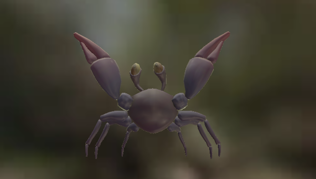
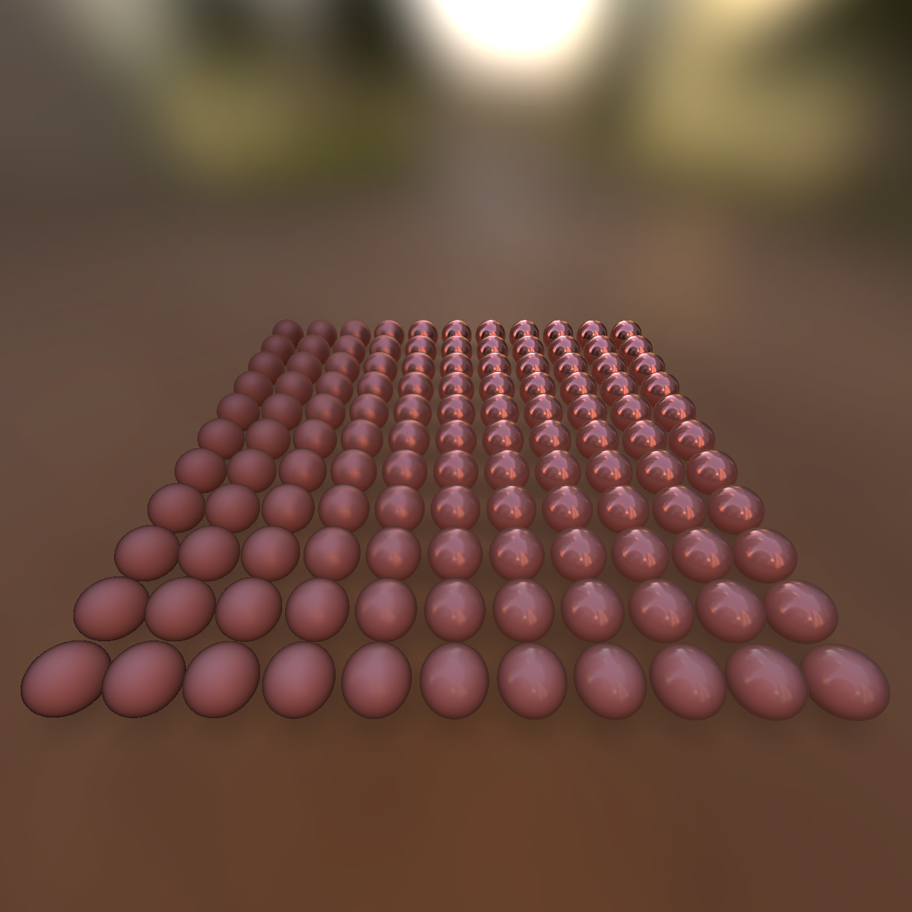
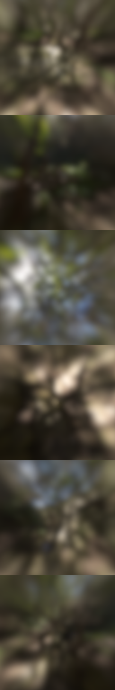

# Physically-Based Rendering Shader.

The shader files in `lullaby/data/shaders/pbr/` provide the means to build a
custom shader featuring a mobile-friendly flavor of [physically-based rendering
(PBR)](https://en.wikipedia.org/wiki/Physically_based_rendering), modeled after
the Standard surface shader in Unity.

Our shaders support lighting a surface with explicit directional lights and/or
an environment map via Image-Based Lighting (IBL), with a choice of traditional
specular or metallic workflows.

## Sample code.

A working sample that uses both a directional light and IBL is in
`examples/hello_pbr`. It renders the scene shown below, featuring a skinned,
animated, textured model rendered inside its lighting environment. This is
useful as a template for starting a new shader.

## Shader controls.

Surfaces to which the PBR shader is applied can be modulated with the parameters
described below. These can be provided via texture maps, as in the
`examples/hello_pbr` example, or can be left constant or computed procedurally
in the top-level shader.

### Linear space for lighting.

When using textures, ensure that any color values from the texture have been
converted from gamma/sRGB to linear space before passing them to the PBR
functions. The **gamma.glslh** file is useful for this. Likewise, ensure that
the final color returned by the top-level shader is converted back to gamma
space.

### Choice of traditional or metallic workflow.

You can choose between a traditional specular workflow, where diffuse and
specular color are specified independently, or a metallic workflow where
specular color is implied by the combination of albedo and metalness. The latter
is a good choice in most cases and saves on texture storage.

Our base implementation is uses the traditional workflow but we provide a
conversion function to transform metallic controls into traditional ones.

#### Traditional Workflow

*   *diffuse color*: Material color for diffuse reflections.
*   *specular color*: Material color for specular reflections.
*   *smoothness*: A perceptually uniform smoothness value in [0.0, 1.0],
    affecting how glossy the surface appears.

#### Metallic Workflow

*   *albedo*: Acts as diffuse color, but also affects specular color on metallic
    surfaces.
*   *smoothness*: A perceptually uniform smoothness value in [0.0, 1.0],
    affecting how glossy the surface appears. Same as in traditional workflow.
*   *metallic*: A value in [0.0, 1.0] controlling whether the surface appears as
    a dielectric (0.0) or metal (1.0), with a blended appearance in between. As
    the metallic value goes from 0.0 to 1.0, the specular color transitions from
    white to the albedo color.

The following array of spheres shows variation in smoothness along one axis and
the metalness in the other.

## Image-Based Lighting textures.

Our IBL implementation relies on preconvolved diffuse and specular environment
textures, in the form of cube maps. Given an HDRI equirect image in OpenEXR
format, the following tool generates the required cube maps to drive our
shader's IBL: //vr/internal/lullaby/tools/env_convolution/. The specular
convolution needs to provide the highest level of smoothness used by all
materials being lit with it. A good default is 0.75.

For the `examples/hello_pbr` example above, the preconvolved diffuse and
specular cube maps look like this:

## Required symbols.

The following preprocessor symbols are used by the PBR shader and need to be
defined to 0 or 1.

*   **LULLABY_PBR_NORMAL_MAP**: Use 1 if the model has a normal map, 0
    otherwise.
*   **LULLABY_PBR_FIBL_AVAILABLE**: This relates to "fake Image-Based Lighting",
    which modulates IBL based on an available camera feed. Not fully integrated
    yet, so most clients should set this to 0.
*   **LULLABY_PBR_SCREEN_SPACE_REFL**: The shader uses specially blended
    screen-space reflections to enhance specular detail from a camera feed. Not
    fully integrated yet so most clients should set this to 0.

## Shader file manifest.

The following shader files are provided. See `examples/hello_pbr` for one
example of how they are used. Depending on the nature of the top-level fragment
shader being written, you may need to include different subsets of these to
access the required functionality.

### Useful to most clients.

*   **env_map.glslh**: Low-level environment texture lookups. Used by
    **pbr_surface_env.glslh** but potentially useful on its own, e.g. for
    rendering the environment map as a background.
*   **gamma.glslh**: Linear <-> gamma-space conversion. Use this (or equivalent
    functionality) to convert any sRGB texture colors to linear space, and to
    convert the final lit result back into gamma space.
*   **normal_map.glslh**: Normal map perturbation and smoothing adjustment. Use
    this if you apply a normal map to your surface.
*   **pbr_surface_common.glslh**: Provides conversion from metallic to
    traditional workflow. Also includes shared internally used functionality.
*   **pbr_surface_env.glslh**: Front end for IBL shading using diffuse and
    specular preconvolved cube maps.
*   **pbr_surface_lights.glslh**: Front end for light-based shading.
*   **specular_conversions.glslh**: Conversions among different representations
    of specular smoothness. Use this if you prefer representing specularity with
    parameters other than perceptual smoothness, e.g. Beckmann roughness or
    Phong exponent.
*   **texture_units.glslh**: Texture unit symbols used for samplers. Use this
    when defining environment maps and surface textures, if any.

### Used internally or reserved for future use.

*   **math_common.glslh**: Internally used math utilities.
*   **rgb2hsv.glslh**: Color space conversion utility, reserved for future use.
*   **screen_projection.glslh**: Screen projection utility, reserved for future
    use.
